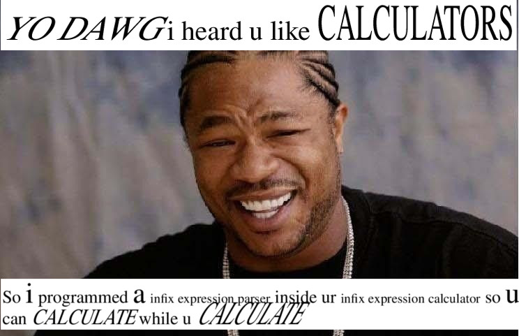

==============
gp-calculator
==============

---------------------------------------------------------------------------
An infix notation calculator within the gp (great-programmable calculator)
---------------------------------------------------------------------------

Text in the meme
----------------
Glad you liked the meme!
Here is how the captions were done:

.. code:: nroff

  .sp |2i
  .nh \" doggo of typesetting disapproves of ur hyphenetion
  .ps 16
  .vs 19.2p
  .ps +4
  \S'30'YO DAWG\S'0'
  .ps
  i heard u like \H'30'CALCULATORS\H'0'

  So \s+(10i\s0 programmed \s+(10a\s0 \s-4infix expression parser\s0 inside ur
  \s-4infix expression calculator\s0 so \s+(10u\s0 can
  \H'20'\S'20'CALCULATE\H'0'\S'0' while u \H'30'\S'30'CALCULATE\H'0'\S'0'

Afterword
=========
Please don't be like me, wasting one's time abusing programs and coercing them
into doing weird shit.
Have a nice day.
